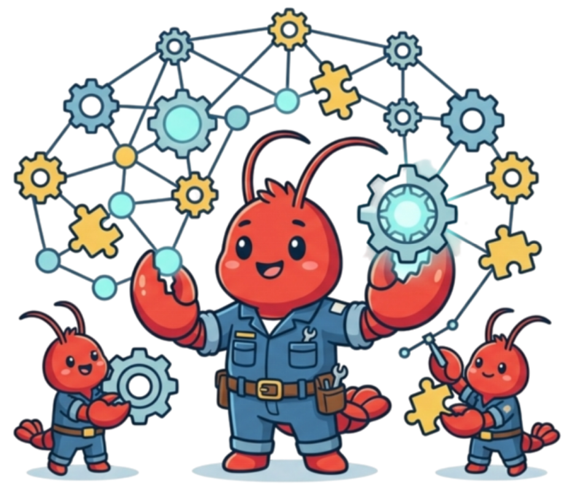
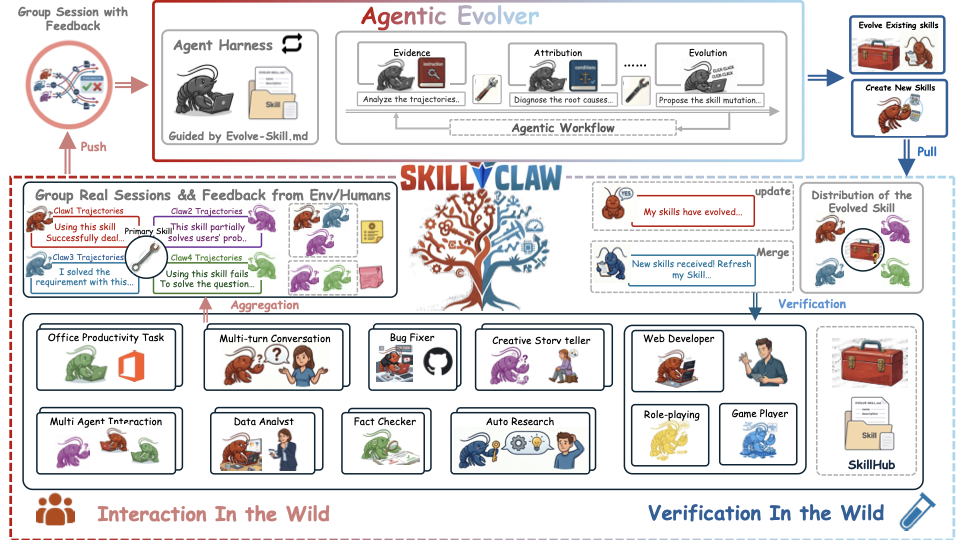

<div align="center">



# SkillClaw: Let Skills Evolve Collectively with Agentic Evolver

<div align="center"> 

<!-- [](https://your-homepage-url.com) -->
[](https://arxiv.org/abs/2604.08377)
[](https://arxiv.org/pdf/2604.08377)
[](https://huggingface.co/papers/2604.08377)

</div>

</div>

> [!NOTE]
> SkillClaw is a framework for **skill collective evolution** in multi-user OpenClaw-style agent ecosystems. It automatically distills real-world experience from multiple users and agents into reusable Skills, and shares them via the cloud to enable continuous evolution across the entire agent cluster.

<div align="center">



[中文](assets/README_ZH.md)

</div>

**Easy to install, effortless to use** — just two commands to set up, and supports a wide range of scenarios. Users simply interact with OpenClaw as usual, and skill evolution happens seamlessly in the background — zero extra effort required.

**Broad framework support** — SkillClaw natively integrates with various Claw frameworks, including CoPaw, IronClaw, PicoClaw, ZeroClaw, NanoClaw, and NemoClaw.

**Proven results** — In real-world scenario evaluations on [WildClawBench](https://github.com/InternLM/WildClawBench), SkillClaw significantly improved Qwen3-Max's performance even under limited group interaction and feedback conditions — not by using a bigger model, but by leveraging smarter experience.

---

## Overview

SkillClaw makes LLM agents progressively better by **evolving reusable skills** from real session data and sharing them across a group of agents.

The system has three components:

1. **Client Proxy** — A local API proxy (`/v1/chat/completions`, `/v1/messages`) that intercepts agent requests, records session artifacts, and syncs skills with shared storage.

2. **Workflow Evolve Server** (`evolve_server`) — A fixed 3-stage LLM workflow (Summarize → Aggregate → Execute) that reads session data from shared storage, evolves or creates skills, and writes them back.

3. **Agent Evolve Server** (`agent_evolve_server`) — An autonomous agent-driven alternative to the workflow evolve server. Uses an OpenClaw agent to read sessions, analyze patterns, and directly write evolved skill files with full tool access (read/write/exec).

All three share the same storage layer (Alibaba OSS / S3 / local filesystem) and skill format (`SKILL.md`), so they are fully interchangeable in a deployment.

---

## Quick Start

### Prerequisites

- Python >= 3.10
- An OpenAI-compatible LLM API endpoint

### 1. Install

Choose one:

```bash
# Client / local development
git clone <repo-url> SkillClaw && cd SkillClaw
bash scripts/install_skillclaw.sh
source .venv/bin/activate

# Server deployment (installs both server entrypoints)
bash scripts/install_skillclaw_server.sh
source .venv-server/bin/activate

# Only needed for the agent evolve server
npm install -g openclaw
```

### 2. Configure & Start the Client Proxy

```bash
export OPENAI_BASE_URL="https://your-api-gateway/v1"
export OPENAI_API_KEY="sk-..."

skillclaw setup
skillclaw start
skillclaw status
skillclaw config show
```

### 3. Start the Evolve Server

SkillClaw provides two evolve servers — pick either one:

Workflow evolve server:

```bash
skillclaw-evolve-server --port 8787 --interval 300 \
  --storage-backend oss \
  --oss-endpoint "$EVOLVE_STORAGE_ENDPOINT" \
  --oss-bucket "$EVOLVE_STORAGE_BUCKET" \
  --group-id my-group
```

Agent evolve server:

```bash
skillclaw-agent-evolve-server --port 8787 --interval 300 --no-fresh \
  --storage-backend oss \
  --oss-endpoint "$EVOLVE_STORAGE_ENDPOINT" \
  --oss-bucket "$EVOLVE_STORAGE_BUCKET" \
  --group-id my-group
```

> `skillclaw-agent-evolve-server` is installed by `scripts/install_skillclaw_server.sh`, but still requires `openclaw` in PATH. See [`agent_evolve_server/README.md`](./agent_evolve_server/README.md) for model and runtime details.

### 4. Skill Management

```bash
skillclaw skills pull          # download shared skills
skillclaw skills push          # upload local skills
skillclaw skills sync          # bidirectional
skillclaw skills list-remote   # browse shared skills
```

---

## WildClawBench Experiments

SkillClaw includes built-in experiment workflows for evaluating skill evolution on the [WildClawBench](https://github.com/InternLM/WildClawBench) benchmark. The main public experiment entrypoint is `scripts/run_wildclawbench_iterative_evolve_agent.py`, and the rest are available via `skillclaw benchmark` CLI commands. See `skillclaw benchmark --help` for all available subcommands.

---

## Project Structure

```
SkillClaw/
├── skillclaw/                  # Client proxy, CLI, config, skill sync, experiments
│   ├── cli.py
│   ├── api_server.py
│   ├── launcher.py
│   ├── skill_manager.py / skill_hub.py
│   └── experiments/
├── evolve_server/              # Workflow evolve server
│   ├── __main__.py
│   ├── server.py
│   ├── summarizer.py / aggregation.py / execution.py
│   └── config.py / llm_client.py / skill_registry.py
├── agent_evolve_server/        # OpenClaw-based evolve server
│   ├── __main__.py
│   ├── server.py
│   ├── workspace.py / openclaw_runner.py
│   └── EVOLVE_AGENTS.md
├── scripts/                    # Installers + main public experiment runner
│   ├── install_skillclaw.sh
│   ├── install_skillclaw_server.sh
│   └── run_wildclawbench_iterative_evolve_agent.py
├── assets/                     # Logo and docs assets
└── pyproject.toml              # Package metadata & extras
```

## Configuration

Configuration lives in `~/.skillclaw/config.yaml` plus environment variables.

- Client / shared credentials: [`example_env.sh`](./example_env.sh)
- Evolve server env template: [`evolve_server/.env.example`](./evolve_server/.env.example)
- Inspect config: `skillclaw config show`
- Update config: `skillclaw config <key> <value>`


## Acknowledgement
The repo is built upon these open-source repos.

[MetaClaw](https://github.com/aiming-lab/MetaClaw) - Just talk to your agent — it learns and evolves

[WildClawBench](https://github.com/InternLM/WildClawBench) - Can an AI agent do real work, end-to-end, without hand-holding

[OpenClaw-RL](https://github.com/Gen-Verse/OpenClaw-RL) - Train a personalized agent simply by talking to it

## Contributing

SkillClaw is a community-driven project. We welcome contributions of all kinds — bug reports, feature requests, new skills, documentation improvements, and more. Feel free to open an issue or submit a pull request!

## License

See [LICENSE](./LICENSE) for details.
